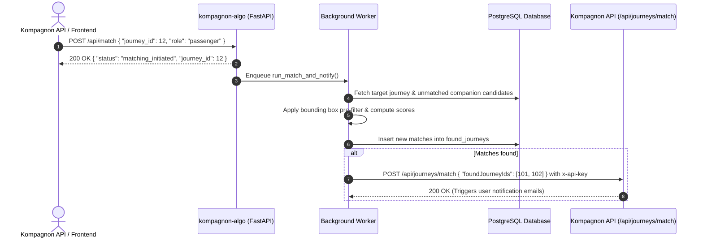

# kompagnon-algo

This repository contains the **multi-criteria matching algorithm & matching service** for Kompagnon — pairing passengers and companions for accessible, shared journeys.

---

## 🗺️ Roadmap & Features

- [x] Setup FastAPI application and routing architecture
- [x] OpenAPI / Swagger documentation (`/api/docs` & `/api/redoc`)
- [x] PostgreSQL database integration with SQLAlchemy models
- [x] Multi-criteria scoring algorithm (Haversine geographic proximity, departure time difference, address similarity)
- [x] Spatial pre-filtering with geographic bounding box (cheap O(N) arithmetic filter to reduce Haversine computations before the Haversine distance loop)
- [x] Asynchronous journey matching triggered via `POST /api/match`
- [x] Automated webhook notification callback to the main Kompagnon API (`POST /api/journeys/match`)
- [x] Batch matching execution mode (`python -m src.algorithm.main`)
- [x] Automated test suite with Pytest & SQLite in-memory isolation

---

## 🏛️ Architecture & Project Structure

```text
kompagnon-algo/
├── src/
│   ├── algorithm/              # Core matching algorithm
│   │   ├── config.py           # Algorithm configuration & weights from env
│   │   ├── main.py             # Batch matching script
│   │   └── matcher.py          # Spatial bounding-box & multi-criteria scoring engine
│   ├── api/                    # FastAPI web application layer
│   │   ├── routes/             # REST endpoints (/api/status, /api/match, /api/root)
│   │   │   ├── match.py        # Trigger matching for a specific journey
│   │   │   ├── root.py         # Root endpoint
│   │   │   └── status.py       # Health check endpoint
│   │   ├── main.py             # FastAPI application entrypoint & middleware setup
│   │   └── schema.py           # Pydantic schemas for request/response validation
│   ├── controller/             # Business logic & background orchestrator
│   │   └── match_controller.py # Coordinates candidate lookup, matching, and notification
│   ├── db/                     # Database layer
│   │   ├── models.py           # SQLAlchemy ORM models (Companion, Passenger, FoundJourney)
│   │   └── session.py          # Database connection pool & session manager
│   ├── notifier/               # Webhook notification client
│   │   └── match_notifier.py   # Posts found journey IDs to Kompagnon API
│   └── repository/             # Data access repository
│       └── journey_repository.py # Queries unmatched journeys and persists matches
├── tests/                      # Unit & integration test suites (94+ tests)
│   ├── algorithm/              # Algorithm & scoring tests
│   ├── controller/             # Controller & background task tests
│   ├── notifier/               # Notifier HTTP client tests
│   ├── repository/             # Repository DB access tests
│   ├── conftest.py             # Test fixtures & in-memory DB setup
│   ├── test_match.py           # API endpoint integration tests
│   ├── test_root.py            # Root route tests
│   ├── test_session.py         # DB connection tests
│   └── test_status.py          # Health check tests
├── configure.sh                # Virtual environment & dependencies installer
├── pyproject.toml              # Build & packaging configuration
├── pytest.ini                  # Pytest runner configuration
├── requirements.txt            # Python dependencies
├── sample.env                  # Environment variables template
├── start.sh                    # Uvicorn server launcher
└── test.sh                     # Test suite launcher
```

---

## ⚙️ Matching Algorithm Pipeline

The matching engine uses a **two-phase spatial and temporal pipeline** to accurately pair companions and passengers:

### 1. Spatial Pre-Filtering (Bounding Box)
Before running trigonometric Haversine distance computations, all candidate journeys are pre-filtered using a **latitude/longitude bounding box** derived from `MATCH_MAX_DISTANCE_KM`. Candidates outside the box are instantly discarded with minimal CPU overhead.

### 2. Multi-Criteria Weighted Scoring (0.0 → 1.0)
Candidate pairs that pass the spatial bounding box are evaluated across three dimensions:

| Criterion | Weight | Evaluation Method | Strict Rejection Threshold |
|---|:---:|---|:---:|
| 🌍 **Geographic Proximity** | **40%** | Haversine distance across departures & arrivals | Distance > `5.0 km` |
| ⏰ **Time Compatibility** | **40%** | Absolute difference in departure timestamps | Difference > `30 min` |
| 📝 **Address Similarity** | **20%** | Case-insensitive normalized text matching | None (bonus score) |

$$\text{Final Score} = (w_{\text{geo}} \times S_{\text{geo}}) + (w_{\text{time}} \times S_{\text{time}}) + (w_{\text{addr}} \times S_{\text{addr}})$$

A pair is accepted as a valid match when $\text{Final Score} \ge \text{MATCH\_MIN\_SCORE}$ (default: `0.5`).

---

## 🔄 Lifecycle & Asynchronous Webhook Workflow



---

## 🚀 Setup & Local Execution

### 1. Installation

Run the configuration script to create a Python virtual environment and install dependencies:

```bash
sh configure.sh
source .venv/bin/activate
```

### 2. Environment Configuration

Copy the template and configure your environment variables:

```bash
cp sample.env .env
```

### 3. Launch the API

Start the FastAPI application with Uvicorn:

```bash
sh start.sh
# Or directly:
uvicorn src.api.main:app --host 0.0.0.0 --port 8000 --reload
```

Interactive API documentation will be available at:
- **Swagger UI**: [http://localhost:8000/api/docs](http://localhost:8000/api/docs)
- **ReDoc**: [http://localhost:8000/api/redoc](http://localhost:8000/api/redoc)

### 4. Batch Matching Execution

To run matching across all pending journeys in the database at once:

```bash
python -m src.algorithm.main
```

---

## 🛠️ Environment Variables Configuration

All parameters can be customized in `.env`:

| Variable | Type | Default | Description |
|---|:---:|:---:|---|
| `PORT` | Integer | `8000` | Port for the Uvicorn server |
| `DATABASE_URL` | String | *Required* | PostgreSQL database connection string |
| `KOMPAGNON_API_URL` | String | `http://localhost:3000/api` | Base URL of the main Kompagnon API |
| `KOMPAGNON_API_KEY` | String | *empty* | Shared API key sent in `x-api-key` header to authenticate webhook (skipped if empty) |
| `MATCH_MAX_DISTANCE_KM` | Float | `5.0` | Maximum radius (km) for geographic proximity |
| `MATCH_PERFECT_DISTANCE_KM` | Float | `0.5` | Distance threshold (km) yielding a perfect 1.0 geo score |
| `MATCH_TIME_TOLERANCE_MINUTES` | Integer | `30` | Maximum difference (minutes) in departure timestamps |
| `MATCH_MIN_SCORE` | Float | `0.5` | Minimum combined score threshold to accept a match |
| `MATCH_WEIGHT_GEO` | Float | `0.40` | Weight coefficient for geographic score |
| `MATCH_WEIGHT_TIME` | Float | `0.40` | Weight coefficient for time compatibility score |
| `MATCH_WEIGHT_ADDRESS` | Float | `0.20` | Weight coefficient for address text match |

---

## 🧪 Testing & Validation

The test suite contains **94+ tests** covering unit logic, database transactions, background workers, and API routes:

```bash
source .venv/bin/activate
pytest
```
