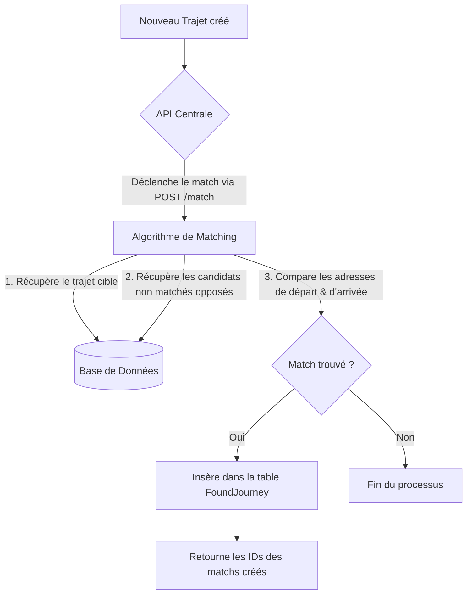

# Module d'Algorithme de Matching (Kompagnon-Algo)

Ce dossier contient le cœur de l'algorithme de mise en relation (matching) entre les trajets des **Accompagnants (Companions)** et des **Accompagnés (Passengers)**.

---

## 📋 Table des Matières
1. [Fonctionnement Global](#1-fonctionnement-global)
2. [Architecture du Code](#2-architecture-du-code)
3. [Modes d'Exécution](#3-modes-dexécution)
   - [À la demande (Événementiel via API)](#a-à-la-demande-événementiel-via-api)
   - [Traitement par Lot (Batch script)](#b-traitement-par-lot-batch-script)
4. [Critères de Matching (Actuels & Futurs)](#4-critères-de-matching-actuels--futurs)
5. [Tests Unitaires](#5-tests-unitaires)

---

## 1. Fonctionnement Global

Le but de l'algorithme est d'associer deux types d'utilisateurs qui partagent un trajet similaire :
* **Accompagnant (Companion)** : L'utilisateur qui propose de faire le trajet.
* **Accompagné (Passenger)** : L'utilisateur qui souhaite être accompagné sur ce trajet.

Une fois un match identifié, une liaison est enregistrée dans la table `found_journeys` (`FoundJourney`) de la base de données avec le statut par défaut `"WAITING"`.



---

## 2. Architecture du Code

Le dossier `src/algorithm/` est composé de trois fichiers clés :

* **`matcher.py`** : Contient la logique pure de comparaison. C'est le "cerveau" algorithmique. La fonction `find_matches()` prend deux listes de dictionnaires en entrée (trajets cibles et candidats) et retourne les couples correspondants.
* **`main.py`** : Point d'entrée script. Il permet de lancer le matching en mode production (batch) directement depuis le terminal ou de servir d'utilitaire pour sauvegarder les correspondances en base de données via la méthode `save_matches()`.
* **`scoring.py`** : Fichier prévu pour héberger les calculs de scores de compatibilité complexes (calcul de distances géodésiques, tolérances horaires, etc.).

---

## 3. Modes d'Exécution

L'algorithme peut être exécuté de deux façons différentes :

### A. À la demande (Événementiel via API)
C'est le comportement attendu en production par l'application Kompagnon. Dès qu'un utilisateur soumet un trajet, l'API centrale envoie une requête HTTP POST à `kompagnon-algo` :

* **Route** : `POST /match`
* **Payload** :
  ```json
  {
    "journey_id": 12,
    "role": "companion"
  }
  ```
L'algorithme se focalise **uniquement** sur ce trajet `12` et cherche des partenaires potentiels parmi les trajets opposés qui n'ont pas encore été associés.

### B. Traitement par Lot (Batch script)
Utile pour les tâches de maintenance, la synchronisation ou les exécutions programmées (cron jobs). Ce script nettoie la base de données en associant tous les trajets orphelins restants.

Pour le lancer manuellement depuis la racine du projet :
```bash
python -m src.algorithm.main
```

---

## 4. Critères de Matching (Actuels & Futurs)

### Logique Actuelle
Actuellement, pour des raisons de simplicité et de mise en place de la base de code (Issue #28), le matching s'effectue sur une **correspondance exacte des chaînes de caractères** des adresses de départ et d'arrivée :
```python
passenger["departureAddress"] == companion["departureAddress"]
passenger["arrivalAddress"] == companion["arrivalAddress"]
```

### Améliorations Futures (Scoring & Géolocalisation)
La base de données contient déjà les coordonnées de latitude/longitude (`departureLat`, `departureLon`, `arrivalLat`, `arrivalLon`) ainsi que les horaires (`departureTime`, `arrivalTime`). 

Les prochaines étapes prévues sont :
1. **Calcul de distance (Haversine)** : Remplacer l'égalité stricte des adresses textuelles par une comparaison des distances géographiques (ex: match si les départs sont à moins de 2km de distance).
2. **Tolérance horaire** : S'assurer que l'heure de départ de l'accompagnateur coïncide avec celle du passager (ex: écart maximum de 30 minutes).
3. **Calcul de score de compatibilité** dans `scoring.py` pour trier les propositions du meilleur au moins bon match.

---

## 5. Tests Unitaires

Chaque composant possède sa suite de tests dédiée dans le dossier `tests/`.

* **`tests/algorithm/test_matcher.py`** : Valide le comportement de l'algorithme (trajets identiques, aucun trajet correspondant, passager unique face à plusieurs conducteurs).
* **`tests/algorithm/test_main.py`** : Simule une base de données SQLite en mémoire pour vérifier que le script de batch extrait, matche, et écrit correctement en DB sans générer d'erreurs d'intégration.

Pour lancer tous les tests de l'algorithme :
```bash
.venv/bin/pytest tests/algorithm/
```
