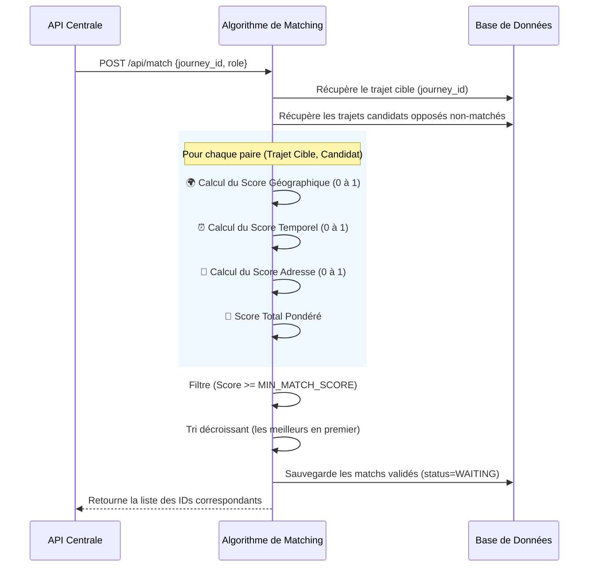

# Module d'Algorithme de Matching (Kompagnon-Algo)

Ce dossier contient le cœur de l'algorithme de mise en relation (matching) entre les trajets des **Accompagnants (Companions)** et des **Accompagnés (Passengers)**.

---

## 📋 Table des Matières
1. [Fonctionnement Global](#1-fonctionnement-global)
2. [Workflow et Diagramme de Séquence](#2-workflow-et-diagramme-de-séquence)
3. [Moteur de Scoring Multi-Critères](#3-moteur-de-scoring-multi-critères)
4. [Architecture du Code](#4-architecture-du-code)
5. [Modes d'Exécution](#5-modes-dexécution)
6. [Tests Unitaires](#6-tests-unitaires)

---

## 1. Fonctionnement Global

Le but de l'algorithme est d'associer deux types d'utilisateurs qui partagent un trajet similaire :
* **Accompagnant (Companion)** : L'utilisateur qui propose de faire le trajet.
* **Accompagné (Passenger)** : L'utilisateur qui souhaite être accompagné sur ce trajet.

Une fois qu'un "match" avec un score suffisant est identifié, une liaison est enregistrée dans la table `found_journeys` de la base de données avec le statut par défaut `"WAITING"`.

---

## 2. Workflow et Diagramme de Séquence

Voici comment l'algorithme s'intègre lors d'une requête standard (par exemple, à la création d'un nouveau trajet) :


```mermaid
sequenceDiagram
    participant App as API Centrale
    participant Algo as Algorithme de Matching
    participant DB as Base de Données

    App->>Algo: POST /api/match {journey_id, role}
    Algo->>DB: Récupère le trajet cible (journey_id)
    Algo->>DB: Récupère les trajets candidats opposés non-matchés
    
    rect rgb(240, 248, 255)
    Note over Algo: Pour chaque paire (Trajet Cible, Candidat)
    Algo->>Algo: 🌍 Calcul du Score Géographique (0 à 1)
    Algo->>Algo: ⏰ Calcul du Score Temporel (0 à 1)
    Algo->>Algo: 📝 Calcul du Score Adresse (0 à 1)
    Algo->>Algo: 🧮 Score Total Pondéré
    end
    
    Algo->>Algo: Filtre (Score >= MIN_MATCH_SCORE)
    Algo->>Algo: Tri décroissant (les meilleurs en premier)
    Algo->>DB: Sauvegarde les matchs validés (status=WAITING)
    Algo-->>App: Retourne la liste des IDs correspondants
```

---

## 3. Moteur de Scoring Multi-Critères

Le système de matching repose sur une évaluation pondérée (de `0.0` à `1.0`) selon trois axes. Les paramètres d'exigence (distances, tolérances, poids) sont configurables via les variables d'environnement.

```mermaid
graph TD
    Geo[🌍 Score Géo - Poids: 40%] --> Total
    Time[⏰ Score Temporel - Poids: 40%] --> Total
    Addr[📝 Score Adresse - Poids: 20%] --> Total
    
    Total{Score Total >= Seuil (0.5) ?}
    
    Total -->|Oui| Match[✅ Match Validé & Sauvegardé]
    Total -->|Non| Rejet[❌ Match Rejeté]
    
    style Match fill:#d4edda,stroke:#28a745,stroke-width:2px
    style Rejet fill:#f8d7da,stroke:#dc3545,stroke-width:2px
```

### A. Critère Géographique (Poids par défaut : 40%)
Le score géographique fait la moyenne entre la proximité des points de **départ** et des points d'**arrivée**.
Il utilise la **distance de Haversine** pour calculer la distance réelle (à vol d'oiseau) entre les coordonnées GPS (`latitude`, `longitude`).

* **Parfait (`1.0`)** : La distance est inférieure ou égale à `PERFECT_DISTANCE_KM` (ex: 0.5 km).
* **Dégressif** : Le score diminue de façon linéaire vers `0.0` à mesure que l'on s'approche de la distance maximale.
* **Éliminatoire (`0.0`)** : Si la distance de départ **OU** d'arrivée dépasse `MAX_DISTANCE_KM` (ex: 5.0 km), le score géographique vaut 0 et bloque souvent la chance d'un match.

### B. Critère Temporel (Poids par défaut : 40%)
Le score temporel compare les heures de départ prévues.

* **Parfait (`1.0`)** : Les deux trajets partent exactement à la même heure.
* **Dégressif** : Le score diminue linéairement selon l'écart en minutes.
* **Éliminatoire (`0.0`)** : Si l'écart dépasse `TIME_TOLERANCE_MINUTES` (ex: 30 minutes), le score temporel tombe à `0.0`.

### C. Critère d'Adresse Textuelle (Poids par défaut : 20%)
Il s'agit d'un bonus s'appuyant sur une comparaison stricte (insensible à la casse et aux espaces superflus) des adresses saisies manuellement.

* **Parfait (`1.0`)** : Les adresses de départ **ET** d'arrivée correspondent exactement.
* **Partiel (`0.5`)** : Seule l'adresse de départ **OU** d'arrivée correspond.
* **Nul (`0.0`)** : Aucune correspondance textuelle.

---

## 4. Architecture du Code

Le dossier `src/algorithm/` est composé de trois fichiers clés :

* **`matcher.py`** : C'est le "cerveau" algorithmique. Contient la fonction `find_matches()` et les sous-fonctions de scoring (`_geo_score`, `_time_score`, `_address_score`, `haversine_distance`).
* **`main.py`** : Point d'entrée pour le traitement en batch. Extrait les données de la DB, matche, et sauvegarde.
* **`config.py`** : Charge et expose les variables d'environnement (poids et tolérances) utilisées par `matcher.py`.

---

## 5. Modes d'Exécution

L'algorithme peut être exécuté de deux façons différentes :

### A. À la demande (Événementiel via API)
Dès qu'un utilisateur soumet un trajet, l'API appelle la route de l'algorithme :
* **Route** : `POST /api/match`
* **Payload** : `{"journey_id": 12, "role": "companion"}`

L'algorithme se focalise **uniquement** sur ce trajet `12` et cherche des partenaires potentiels parmi les trajets opposés qui n'ont pas encore été associés.

### B. Traitement par Lot (Batch script)
Utile pour les tâches de maintenance, la synchronisation ou les exécutions programmées (cron jobs). Ce script nettoie la base de données en essayant d'associer tous les trajets orphelins restants.

```bash
python -m src.algorithm.main
```

---

## 6. Tests Unitaires

Chaque composant possède sa suite de tests dédiée dans le dossier `tests/`.

* **`tests/algorithm/test_matcher.py`** : Valide intensivement la logique du score (distance Haversine, tolérance horaire, pondérations du score global).
* **`tests/algorithm/test_main.py`** : Simule une base de données SQLite en mémoire pour vérifier que le script de batch extrait, matche, et écrit correctement en DB.

Pour lancer tous les tests de l'algorithme :
```bash
sh test.sh
# ou manuellement: pytest tests/algorithm/
```
