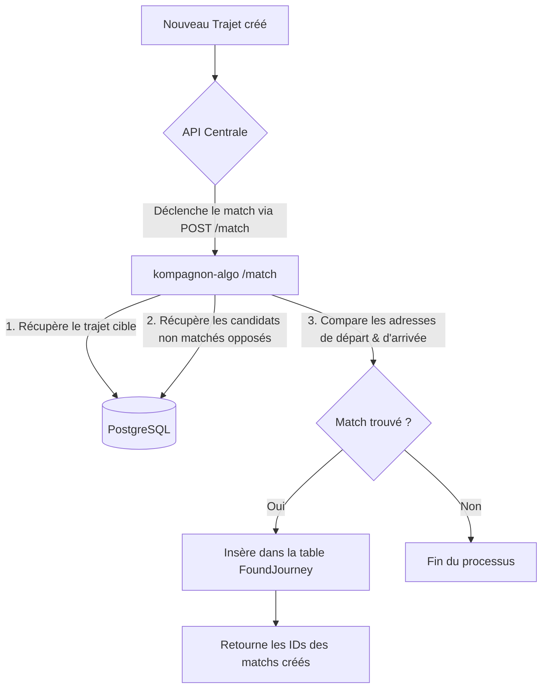

# Description de la Pull Request (PR) - Issue #28

Cette PR implémente les fondations du système de matching du projet **kompagnon-algo**. Elle répond entièrement à l'issue #28 en créant le moteur de matching de base, en le connectant à la base de données PostgreSQL, en exposant une API de matching événementiel à la demande, et en assurant la robustesse du code via une couverture de tests unitaires et d'intégration à 100%.

---

## 🎯 Objectifs Réalisés

1. **Moteur Algorithmique (`src/algorithm/matcher.py`)** :
   - Implémentation de la fonction `find_matches` qui filtre et compare les adresses de départ/arrivée.
   - Typage complet et logs structurés de toutes les opérations.
2. **Point d'Entrée Batch (`src/algorithm/main.py`)** :
   - Capacité d'exécuter le script de matching en mode global (batch) depuis le terminal (`python -m src.algorithm.main`).
   - Requêtes optimisées pour récupérer uniquement les trajets n'ayant pas encore de liaison dans la table `FoundJourney`.
   - Sauvegarde automatisée des résultats du matching via SQLAlchemy dans la table `FoundJourney` avec le statut `"WAITING"`.
3. **API Événementielle (`src/api/routes/match.py`)** :
   - Route `POST /match` pour matcher un trajet spécifique à la demande (ex: déclenché juste après sa création par l'API principale).
   - Gestion des rôles `companion` (conducteur) et `passenger` (passager).
   - Retourne directement les IDs des correspondances créées en base de données.
4. **Documentation Complète** :
   - Création de `doc/README_algo.md` détaillant l'architecture, le flux de données (schémas Mermaid) et le plan d'évolution technique (Haversine, scoring).
   - Réorganisation propre et tri alphabétique (style VS Code) de l'architecture du projet dans le `README.md` racine.
5. **Robustesse et Tests (19 tests au total)** :
   - Tests du moteur pure (`test_matcher.py`).
   - Tests d'intégration avec session de base de données SQLite en mémoire pour le script principal (`test_main.py`).
   - Tests unitaires et cas d'erreurs pour la route d'API `/match` (`test_match.py`).

---

## 🔍 Visualisation du Flux de Matching

Voici comment s'articule le flux mis en place dans cette PR conformément à la conception globale :



---

## 🛠️ Comment Tester Localement ?

### 1. Préparer l'environnement
Assure-toi d'avoir installé les dépendances et activé l'environnement virtuel :
```bash
./configure.sh
source .venv/bin/activate
```

### 2. Exécuter les Tests
Lance la suite complète de tests (tous doivent passer au vert) :
```bash
sh test.sh
```

### 3. Lancer l'API locale
Démarre le serveur FastAPI :
```bash
sh start.sh
```

### 4. Tester la route `/match`
Tu peux tester la route en envoyant une requête POST (par exemple via Postman ou curl) :
```bash
curl -X POST http://localhost:8000/match \
     -H "Content-Type: application/json" \
     -d '{"journey_id": 1, "role": "companion"}'
```
*Si le trajet `1` existe dans `companion_journeys` et qu'un trajet identique et libre existe dans `passenger_journeys`, un match sera créé et enregistré dans `found_journeys`.*

---

## 🚀 Prochaines Étapes Suggérées

- **Évolution Géospatiale** : Remplacer l'égalité stricte des chaînes d'adresses par une comparaison des distances géographiques (formule Haversine) grâce aux coordonnées de latitude/longitude.
- **Tolérance Horaire** : Filtrer les départs sur une fenêtre de temps personnalisable (ex: ±30 min).
- **Scoring System (`scoring.py`)** : Établir un score de compatibilité pondéré pour trier les partenaires si plusieurs sont éligibles.
